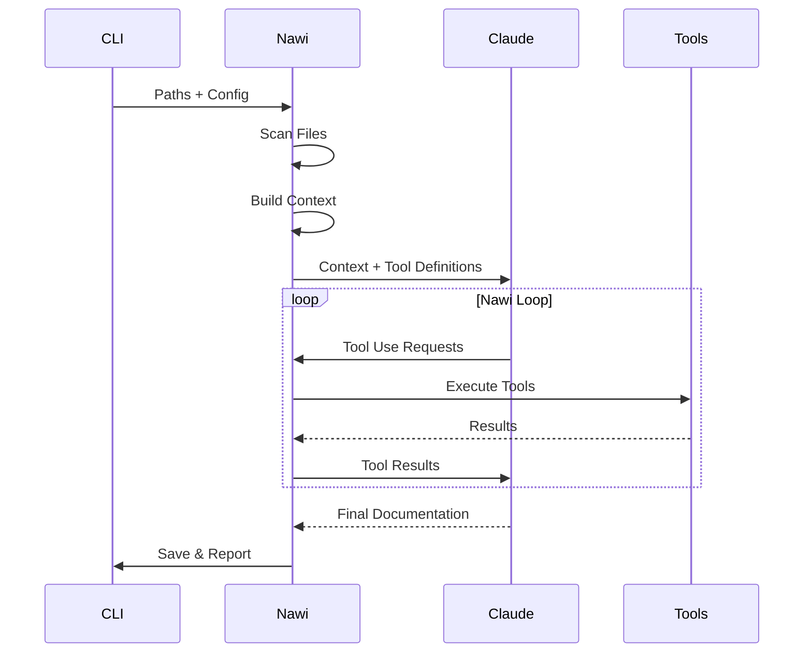

<div align="center">
  
  <br>
</div>

# Nawi - Agente Documentador Inteligente

[](https://www.python.org/)
[](https://www.anthropic.com/)
[](https://opensource.org/licenses/MIT)

**O Nawi é um agente inteligente baseado em tools para geração automática de documentação técnica profissional usando Claude AI**

## Visão Geral

Este agente utiliza a arquitetura tool-based do Claude para analisar projetos de software em profundidade e gerar documentação técnica de alta qualidade. Diferente de soluções simples que apenas formatam código, este agente:

- **Analisa estrutura de código** usando AST parsing

- **Detecta padrões arquiteturais** (MVC, Clean Architecture, Microservices, etc)

- **Mapeia dependências** internas e externas

- **Avalia qualidade do código** com métricas objetivas

- **Gera documentação contextual** baseada em análises reais


## Estrutura do Agente

```
nawi-agent/
├── agent.py                        # Agente principal com loop tool-based
├── main.py                         # CLI interface
├── requirements.txt
├── test.py                         # Verificação de arquivos, pastas e dependências
├── core/
│   ├── __init__.py
│   ├── claude_client.py            # Cliente API com suporte a tools
│   ├── file_scanner.py             # Scanner de arquivos
│   └── context_builder.py          # Construtor de contexto
│
├── docs/
│   └── EXAMPLE.md                  # Casos de uso com exemplos
│
├── tools/
│   ├── __init__.py
│   ├── base_tool.py                # Classe abstrata para tools
│   ├── code_analyzer.py            # Análise de código
│   ├── architecture_detector.py    # Detecção de arquitetura
│   ├── dependency_mapper.py        # Mapeamento de dependências
│   └── quality_checker.py          # Verificação de qualidade
│
├── templates/
│   ├── __init__.py
│   └── doc_templates.py            # Templates de documentação
│
└── utils/
    ├── __init__.py
    └── logger.py                   # Sistema de logging
```

## Pré-requisitos

- Python 3.12+
- Conta na Anthropic com API key
- Conexão com internet

## Instalação

### 1. Clone o repositório

```bash
git clone <repository-url>
cd doc_agent
```

### 2. Instale as dependências

```bash
pip install -r requirements.txt
```

### 3. Configure a API Key

**Linux/Mac:**
```bash
export ANTHROPIC_API_KEY='sua-chave-aqui'
```

**Windows:**
```cmd
set ANTHROPIC_API_KEY=sua-chave-aqui
```

**Ou crie um arquivo `.env`:**
```bash
echo "ANTHROPIC_API_KEY=sua-chave-aqui" > .env
```

**Obtenha sua chave em:** https://console.anthropic.com/

### 4. Torne o script executável (Linux/Mac)

```bash
chmod +x main.py
```

## Como Usar

### Uso Básico

```bash
# Documentar um diretório
python main.py ./src

# Documentar arquivo único
python main.py script.py

# Múltiplos caminhos
python main.py ./src ./tests ./config

# Especificar saída
python main.py ./src -o docs/README.md

# Especificar nome do projeto
python main.py ./src -n "Meu Projeto API"
```

### Uso Avançado

```bash
# Template específico
python main.py ./api -t api -o API_DOCS.md

# Modo verbose (mais logs)
python main.py ./src -v

# API key inline
python main.py ./src --api-key sk-ant-xxx

# Modo legado sem tools
python main.py ./src --no-tools
```

### Opções Disponíveis

```
positional arguments:
  paths                 Caminhos para analisar (diretórios ou arquivos)

optional arguments:
  -h, --help           Mostra ajuda
  -o, --output         Caminho do arquivo de saída (default: README.md)
  -n, --name           Nome do projeto (default: Projeto)
  -t, --template       Template: auto, single_file, small_project, full_project, api
  --no-tools           Desabilita uso de tools (modo legado)
  -v, --verbose        Modo verbose
  --fast               Modo rápido (menos contexto/iterações)
  --api-key            API Key da Anthropic
```

---

## Funcionamento do Nawi

### Workflow Tool-Based



### Fluxo de Análise

1. **Escaneamento**: FileScanner identifica e organiza arquivos relevantes

2. **Contexto**: ContextBuilder prepara contexto estruturado

3. **Análise**: Claude invoca tools automaticamente:

   - `code_analyzer` - Extrai estrutura e métricas

   - `architecture_detector` - Identifica padrões

   - `dependency_mapper` - Mapeia dependências

   - `quality_checker` - Avalia qualidade

4. **Síntese**: Claude processa resultados e gera documentação

5. **Output**: Documentação salva em Markdown profissional

### Componentes Principais

#### Core (`/core`)

- **ClaudeClient**: Cliente para API da Anthropic com suporte a tool use

- **FileScanner**: Escaneia e organiza arquivos do projeto

- **ContextBuilder**: Constrói contexto estruturado para o Claude

#### Tools (`/tools`)

- **CodeAnalyzerTool**: Analisa código fonte usando AST, extrai estruturas e métricas

- **ArchitectureDetectorTool**: Detecta padrões arquiteturais com confiança

- **DependencyMapperTool**: Mapeia dependências diretas, transitivas e circulares
- **QualityCheckerTool**: Avalia qualidade com scores e recomendações

#### Templates (`/templates`)

- **DocumentationTemplateManager**: Gerencia templates para diferentes tipos de documentação

#### Utils (`/utils`)

- **Logger**: Sistema de logging com cores e níveis

## Tools Disponíveis

### 1. CodeAnalyzerTool

Analisa código fonte em profundidade usando AST parsing.

**Capacidades:**

- Extrai funções, classes, métodos
- Identifica imports e dependências
- Calcula complexidade ciclomática
- Detecta padrões de código

**Suporta:** Python, JavaScript, TypeScript

### 2. ArchitectureDetectorTool

Detecta padrões arquiteturais no projeto.

**Identifica:**

- MVC, MVP, MVVM
- Clean Architecture / Hexagonal
- Microservices vs Monolito
- Repository Pattern
- Domain-Driven Design (DDD)
- Event-Driven Architecture

**Retorna:** Padrões com confiança e evidências

### 3. DependencyMapperTool

Mapeia todas as dependências do projeto.

**Analisa:**

- Dependências externas (npm, pip, maven, etc)
- Dependências internas entre módulos
- Dependências transitivas
- Dependências circulares

**Gera:** Grafo de dependências + métricas

### 4. QualityCheckerTool

Avalia qualidade do código objetivamente.

**Métricas:**

- Cobertura de documentação
- Presença de testes
- Convenções de nomenclatura
- Complexidade de código
- Seguimento de boas práticas

**Retorna:** Score geral + recomendações

## Templates

O agente possui templates especializados:

### Single File

Para documentar um único arquivo com foco em funcionalidade específica.

### Small Project

Para projetos com 2-5 arquivos, documentação concisa.

### Full Project (Default)

Para projetos completos, documentação abrangente com:
- Arquitetura detalhada
- Guia de instalação
- Análise de qualidade
- Troubleshooting

### API

Template específico para documentação de APIs REST/GraphQL.

---

## Exemplos de Uso

### Exemplo 1: Documentar Script Python

```bash
python main.py meu_script.py -n "Script de Automação" -t "single_file"
```

**Resultado:** Documentação focada no arquivo específico com análise de funções, classes e uso.

### Exemplo 2: Documentar Vários Arquivos

```bash
python main.py ./notebooks/eda.py ./src/script.py -n "Análises Exploratórias" -o ./docs/documentacao_eda.md
```

**Resultado:** Documentação completa do notebook e script com output selecionado.

### Exemplo 3: Análise de Qualidade

```bash
python main.py ./src -v
```

**Resultado:** Documentação + logs detalhados mostrando:

- Score de qualidade por categoria
- Padrões arquiteturais detectados
- Dependências mapeadas
- Recomendações de melhoria

## Extensibilidade

### Criando Novas Tools

```python
from tools.base_tool import Tool
from typing import Dict, Any

class MinhaCustomTool(Tool):
    @property
    def name(self) -> str:
        return "minha_tool"
    
    @property
    def description(self) -> str:
        return "Descrição do que a tool faz"
    
    @property
    def input_schema(self) -> Dict[str, Any]:
        return {
            "type": "object",
            "properties": {
                "param": {"type": "string", "description": "..."}
            },
            "required": ["param"]
        }
    
    async def execute(self, input_data: Dict[str, Any]) -> Any:
        # Sua lógica aqui
        return {"result": "..."}
```

### Registrando Tool

```python
# Em agent.py, método _register_tools()
from tools.minha_tool import MinhaCustomTool

self.tools.append(MinhaCustomTool())
```

### Criando Templates Customizados

```python
from templates.doc_templates import DocumentationTemplate

template = DocumentationTemplate(
    name="meu_template",
    description="Template para X",
    system_prompt="Instruções detalhadas..."
)

template_manager.register_template(template)
```

---

## Comparação: Versão 2.0 vs Versão 3.0 Tool-Based

| Aspecto | Antiga Versão | Tool-Based |
|---------|----------|------------|
| **Análise** | Superficial | Profunda com AST |
| **Arquitetura** | Não detecta | Detecta padrões |
| **Dependências** | Lista básica | Grafo completo |
| **Qualidade** | Não avalia | Score + métricas |
| **Extensibilidade** | Limitada | Modular |
| **Precisão** | Estimativa | Dados reais |
| **Manutenibilidade** | Monolítico | Modular |

## Vantagens da Arquitetura Tool-Based

1. **Análise Profunda**: Tools extraem dados reais ao invés de estimativas
2. **Modularidade**: Cada tool é independente e testável
3. **Extensibilidade**: Fácil adicionar novas tools sem modificar core
4. **Reutilização**: Tools podem ser usadas em outros contextos
5. **Precisão**: Documentação baseada em análises objetivas
6. **Adaptabilidade**: Claude escolhe quais tools usar automaticamente

## Limitações Conhecidas

- **Tamanho de Arquivo**: Limitado a 100KB por arquivo (configurável)
- **Linguagens**: Análise completa apenas para Python e JavaScript/TS
- **API Rate Limits**: Sujeito aos limites da API Anthropic
- **Token Limit**: Context window de ~200K tokens

---

## Troubleshooting

### Erro: "API Key não encontrada"

**Solução:** Configure a variável de ambiente `ANTHROPIC_API_KEY`

```bash
export ANTHROPIC_API_KEY='sua-chave'
```

### Erro: "Module not found"

**Solução:** Instale as dependências

```bash
pip install -r requirements.txt
```

### Documentação incompleta

**Solução:** Use modo verbose para diagnosticar

```bash
python main.py ./src -v
```

### Tools não sendo executadas

**Solução:** Verifique logs verbose. Se persistir, use `--no-tools` temporariamente

---

## Changelog

### v3.0 - Fevereiro 2026 (ATUAL)

**Nova Arquitetura:**

- Sistema completo baseado em tools independentes
- Loop tool-based para análises profundas
- Separação modular em 20 arquivos

**Novas Tools:**

- CodeAnalyzerTool: AST parsing Python
- ArchitectureDetectorTool: 6+ padrões
- DependencyMapperTool: Grafo + circulares
- QualityCheckerTool: Score 0-100

**Novas Funcionalidades:**

- CLI profissional com flags
- Modo verbose para debugging
- Sistema de logging com cores
- Templates extensíveis
- Suporte a arquivos específicos
- Modo não-interativo para CI/CD

### v2.0 - Janeiro 2026

**Funcionalidades:**

- Sistema adaptativo de detecção de contexto
- Três modos de documentação (arquivo único, projeto pequeno, projeto completo)
- System prompts especializados por contexto
- Métodos internos separados para cada tipo de geração

**Melhorias:**

- Documentação mais relevante e contextual
- Evita seções desnecessárias para arquivos únicos
- Melhor experiência para análise de scripts isolados
- Output indica modo detectado

**Correções:**

- Arquivo único não é mais tratado como "projeto completo"
- Documentação não menciona instalação quando inadequado

### v1.0 - Dezembro 2025

**Funcionalidades Iniciais:**
- Escaneamento de diretórios
- Geração de documentação com Claude
- Suporte a Python, Notebooks, Terraform, JSON, Markdown
- System prompt profissional único


## Contribuindo

Contribuições são bem-vindas! Áreas de interesse:

1. Novas tools
2. Suporte a mais linguagens
3. Templates especializados
4. Melhorias no parsing
5. Testes automatizados

---

**Projeto Open Source** | **Licenciado sob MIT** | **Última atualização: Fevereiro 2026** | **Versão: 3.0**


