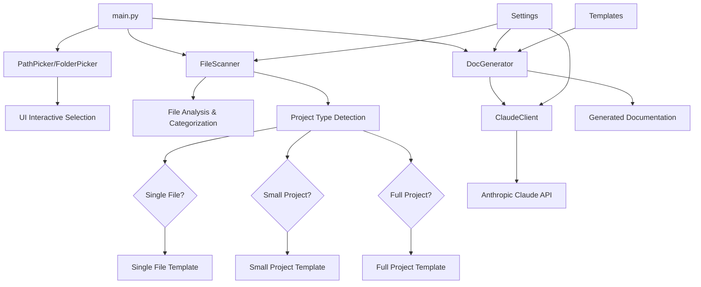

# Agente Nawi - Light Mode

[](https://python.org)
[](https://anthropic.com)
[](LICENSE)
[](https://github.com)

Sistema inteligente de documentação automatizada que analisa projetos, pastas ou arquivos específicos e gera documentação contextual de alta qualidade usando a API Claude da Anthropic.

## Visão Geral do Projeto

O Agente Nawi é uma ferramenta de documentação técnica automatizada que resolve o problema da documentação inconsistente ou inexistente em projetos de desenvolvimento. Utilizando a inteligência artificial do Claude, o sistema analisa códigos, estruturas de projeto e gera documentação profissional e contextualizada.

### Principais Features

- Análise inteligente de estruturas de projeto com detecção automática de tipos
- Geração de documentação contextual baseada no tamanho e complexidade do projeto
- Suporte a múltiplas linguagens e tecnologias (Python, Terraform, Notebooks, SQL, YAML)
- Interface de linha de comando intuitiva com seleção interativa de caminhos
- Configurações flexíveis para diferentes cenários de documentação
- Filtragem automática de arquivos irrelevantes e otimização de contexto

### Arquitetura do Sistema


```mermaid
graph TB
    A[main.py] --> B[PathPicker/FolderPicker]
    A --> C[FileScanner]
    A --> D[DocGenerator]
    
    B --> E[UI Interactive Selection]
    C --> F[File Analysis & Categorization]
    D --> G[ClaudeClient]
    
    H[Settings] --> C
    H --> D
    H --> G
    
    I[Templates] --> D
    
    C --> J[Project Type Detection]
    J --> K{Single File?}
    J --> L{Small Project?}
    J --> M{Full Project?}
    
    K --> N[Single File Template]
    L --> O[Small Project Template]
    M --> P[Full Project Template]
    
    G --> Q[Anthropic Claude API]
    D --> R[Generated Documentation]
```

## Pré-requisitos

### Ferramentas Necessárias

- **Python**: 3.8 ou superior
- **pip**: Para instalação de dependências
- **Git**: Para clonagem do repositório

### Conhecimentos Recomendados

- Conceitos básicos de Python e desenvolvimento de software
- Familiaridade com APIs REST e chaves de autenticação
- Conhecimento de estruturas de projeto de desenvolvimento

### Credenciais Necessárias

- **Chave API Anthropic**: Obtenha em [console.anthropic.com](https://console.anthropic.com)
- Créditos suficientes na conta Anthropic para uso da API Claude

## Estrutura do Projeto

```
agente-nawi/
├── main.py                     # Ponto de entrada principal do sistema
├── config/
│   ├── __init__.py            # Exportações do módulo de configuração
│   └── settings.py            # Configurações centralizadas do sistema
├── prompts/
│   ├── __init__.py            # Exportações dos templates
│   └── templates.py           # Templates de prompt para diferentes tipos
├── scanner/
│   ├── __init__.py            # Exportações do scanner
│   └── file_scanner.py        # Motor de análise e categorização de arquivos
├── src/
│   ├── __init__.py            # Exportações principais
│   ├── claude_client.py       # Cliente HTTP para API Anthropic
│   └── doc_generator.py       # Orquestrador de geração de documentação
├── ui/
│   ├── __init__.py            # Exportações da interface
│   ├── path_picker.py         # Seletor interativo de caminhos
│   └── folder_picker.py       # Seletor interativo de pastas
├── utils/
│   ├── __init__.py            # Utilitários diversos
│   └── logger.py              # Sistema de logging colorido
└── requirements.txt           # Dependências do Python
```

## Guia de Instalação

### 1. Clonar o Repositório

```bash
git clone https://github.com/seu-usuario/agente-nawi.git
cd agente-nawi
```

### 2. Criar Ambiente Virtual

```bash
python -m venv venv
source venv/bin/activate  # Linux/Mac
# ou
venv\Scripts\activate     # Windows
```

### 3. Instalar Dependências

```bash
pip install -r requirements.txt
```

### 4. Configurar Variável de Ambiente

```bash
# Linux/Mac
export ANTHROPIC_API_KEY="sua-chave-api-aqui"

# Windows
set ANTHROPIC_API_KEY=sua-chave-api-aqui
```

### 5. Verificar Instalação

```bash
python main.py --help
```

## Como Usar

### Execução Interativa Básica

```bash
python main.py
```

O sistema iniciará o modo interativo onde você pode:
- Selecionar caminhos específicos para análise
- Escolher pasta de saída para documentação
- Definir nome do projeto e arquivo de saída

### Comandos Principais

```bash
# Executar análise completa interativa
python main.py

# Especificar projeto específico
python main.py --project "Nome do Projeto"

# Definir pasta de saída
python main.py --output "./docs"
```

### Casos de Uso Comuns

#### 1. Documentar Arquivo Único
- Selecione um arquivo Python, notebook ou script
- O sistema detectará automaticamente como "single_file"
- Gerará documentação focada na funcionalidade específica

#### 2. Documentar Projeto Pequeno (2-5 arquivos)
- Selecione alguns arquivos relacionados
- Sistema aplicará template "small_project"
- Documentação concisa e direta

#### 3. Documentar Projeto Completo
- Selecione pasta inteira do projeto
- Sistema escaneará automaticamente arquivos relevantes
- Gerará documentação abrangente com arquitetura

## Documentação de Componentes

### main.py - Orquestrador Principal

**Responsabilidade**: Ponto de entrada e coordenação do fluxo principal
- Gerencia a interação entre UI, scanner e gerador
- Valida caminhos e configurações
- Controla o fluxo assíncrono de execução

### config/settings.py - Configurações Centralizadas

**Responsabilidade**: Todas as configurações do sistema
- Limites de tokens por tipo de documentação
- Extensões de arquivo suportadas
- Thresholds para detecção de tipo de projeto
- Diretórios e arquivos a serem ignorados

### scanner/file_scanner.py - Motor de Análise

**Responsabilidade**: Análise e categorização de arquivos
- Escaneamento recursivo de diretórios
- Filtragem por extensão e tamanho
- Categorização automática de arquivos
- Detecção de tipo de projeto baseada em heurísticas

### src/claude_client.py - Cliente API

**Responsabilidade**: Comunicação com API Anthropic
- Requisições HTTP assíncronas
- Gerenciamento de headers e autenticação
- Tratamento de erros de API
- Controle de limites de tokens

### prompts/templates.py - Sistema de Templates

**Responsabilidade**: Templates de prompt especializados
- Template para arquivo único
- Template para projeto pequeno  
- Template para projeto completo
- Diretrizes de formatação profissional

## Configuração

### Variáveis de Ambiente

| Variável | Descrição | Obrigatório | Exemplo |
|----------|-----------|-------------|---------|
| `ANTHROPIC_API_KEY` | Chave da API Anthropic | Sim | `sk-ant-api03-...` |

### Configurações do Sistema

As configurações principais estão em `config/settings.py`:

| Configuração | Valor Padrão | Descrição |
|--------------|--------------|-----------|
| `MODEL` | `claude-sonnet-4-20250514` | Modelo Claude utilizado |
| `MAX_TOKENS_SINGLE_FILE` | `6000` | Tokens para arquivo único |
| `MAX_TOKENS_SMALL_PROJECT` | `6000` | Tokens para projeto pequeno |
| `MAX_TOKENS_FULL_PROJECT` | `8000` | Tokens para projeto completo |
| `MAX_FILE_SIZE_BYTES` | `100000` | Tamanho máximo por arquivo |
| `SINGLE_FILE_THRESHOLD` | `1` | Limite para arquivo único |
| `SMALL_PROJECT_THRESHOLD` | `5` | Limite para projeto pequeno |

### Extensões Suportadas

```python
EXTENSIONS = {
    'python': ('.py',),
    'notebooks': ('.ipynb',),
    'terraform': ('.tf', '.tfvars'),
    'json': ('.json',),
    'markdown': ('.md',),
    'sql': ('.sql',),
    'yaml': ('.yml', '.yaml'),
}
```

## Troubleshooting

### Problemas Comuns

#### 1. Erro de Autenticação API
```bash
# Verificar se a chave está definida
echo $ANTHROPIC_API_KEY

# Redefinir a chave
export ANTHROPIC_API_KEY="sua-chave-correta"
```

#### 2. Arquivo Muito Grande
- **Sintoma**: "Arquivo muito grande (>100KB)"
- **Solução**: Ajustar `MAX_FILE_SIZE_BYTES` em settings.py ou dividir arquivo

#### 3. Muitos Arquivos no Contexto
- **Sintoma**: Erro de limite de tokens
- **Solução**: Reduzir `MAX_FILES_IN_CONTEXT_FULL` ou usar seleção mais específica

### Comandos de Diagnóstico

```bash
# Verificar estrutura do projeto
find . -name "*.py" -type f | head -10

# Verificar tamanho dos arquivos
find . -name "*.py" -exec ls -la {} \; | head -5

# Testar conectividade com API (curl)
curl -H "x-api-key: $ANTHROPIC_API_KEY" \
     -H "anthropic-version: 2023-06-01" \
     https://api.anthropic.com/v1/messages
```

### Logs do Sistema

O sistema utiliza logging colorido para facilitar o diagnóstico:
- **Verde**: Operações bem-sucedidas
- **Amarelo**: Avisos não críticos
- **Vermelho**: Erros que impedem execução
- **Azul**: Informações de progresso

## Próximos Passos / Roadmap

### Melhorias Planejadas

- **Suporte a Mais Linguagens**: Adicionar Go, Rust, JavaScript/TypeScript
- **Cache Inteligente**: Evitar reprocessamento desnecessário de arquivos
- **Integração Git**: Documentar apenas arquivos modificados
- **Templates Personalizados**: Permitir templates customizados por tipo de projeto
- **Interface Web**: Versão web para uso em equipes
- **Integração CI/CD**: Plugin para pipelines de integração contínua
- **Métricas de Qualidade**: Scoring automático da documentação gerada

---

**Desenvolvido com foco em produtividade e qualidade de documentação técnica.**
